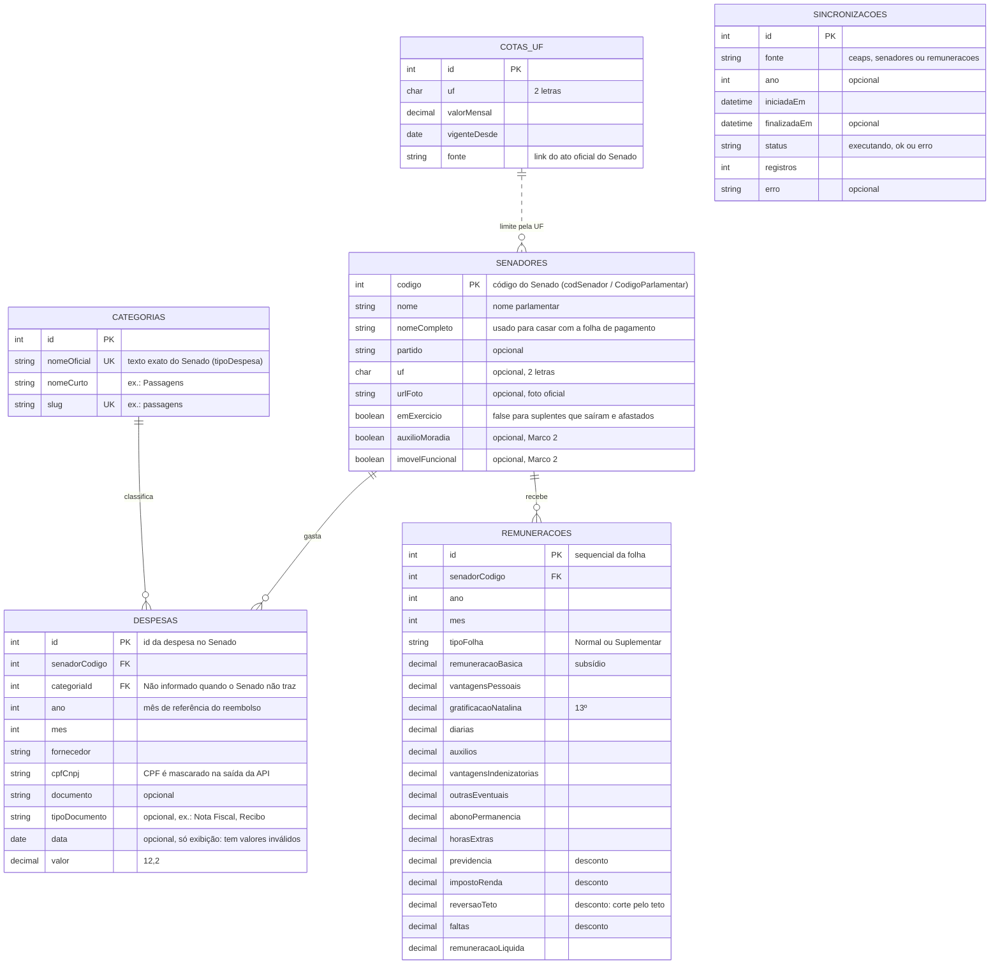

# Banco de dados

Estrutura completa planejada do banco, com o que entra em cada marco. O schema executável está em
`packages/db/prisma/schema.prisma`; este documento explica o porquê de cada decisão.

## Diagrama

`COTAS_UF` não tem chave estrangeira: a ligação com o senador é lógica, pela UF.

## Tabelas por marco

| Tabela | Marco | Para que serve | Fonte |
| :-- | :-- | :-- | :-- |
| `senadores` | 1 | Quem é o senador; filtro por UF e por exercício | API legislativa (`/senador/lista/atual`) + nomes da CEAPS |
| `categorias` | 1 | Nome curto e URL das 7 categorias da cota, mais "Não informado" | Seed, a partir dos textos da CEAPS |
| `despesas` | 1 | Cada nota reembolsada pela cota parlamentar | API administrativa (`/senadores/despesas_ceaps/{ano}`) |
| `sincronizacoes` | 1 | "Dados atualizados em…" e histórico de execuções | Gerada pelo `apps/sync` |
| `remuneracoes` | 2 | Salário do senador e de onde vem cada ganho | API administrativa (`/servidores/remuneracoes/{ano}/{mes}`) |
| `cotas_uf` | 2 | Limite mensal da cota por estado | Seed, a partir do ato oficial do Senado |

Os campos `auxilioMoradia` e `imovelFuncional` de `senadores` também são do Marco 2
(`/senadores/{codigo}/recursos-utilizados`).

## Decisões

**Chaves.** As chaves primárias de `senadores` e `despesas` são os códigos do próprio Senado. Assim a
sincronização sabe, sem ambiguidade, se um registro já existe, e nada é duplicado.

**Normalização.** O nome do senador fica só em `senadores`; `despesas` e `remuneracoes` guardam
apenas o código (chave estrangeira).

**Dinheiro em `Decimal(12,2)`, nunca `Float`.** Float tem erro de arredondamento
(`0.1 + 0.2 = 0.30000000000000004`), o que faria os totais divergirem do Senado.

**Totais calculados na hora.** "Quanto o senador gastou por categoria" é um `GROUP BY` sobre
`despesas`, apoiado pelo índice `(senadorCodigo, ano)`. Não há tabela de totais: ela poderia ficar
diferente das despesas se uma atualização falhasse no meio.

**Ano e mês, não data.** Consultas filtram por `ano`/`mes` (competência do reembolso). O campo `data`
da nota tem valores inválidos na fonte (anos como 2006 e datas no futuro) e serve só para exibição.

**Despesa sem categoria.** Entra na categoria "Não informado", para que toda despesa conte na soma e o
total bata com o do Senado.

## Dados pessoais

O repositório e a API são públicos, e a LGPD pede coletar só o necessário (minimização).

- **`detalhamento` da CEAPS não é armazenado.** Ele traz nome e matrícula de assessores que viajaram,
  e nenhuma funcionalidade o usa.
- **CPF de fornecedor pessoa física** é guardado como publicado, mas mascarado na saída da API.
- **Folha de pagamento:** só as linhas de senadores são gravadas. Servidores ficam de fora.

## Sincronização

Feita pelo `apps/sync`, uma vez por dia. A API nunca consulta o Senado durante uma requisição.

- **Despesas:** para cada ano, dentro de uma transação, apaga as despesas do ano e insere o que veio.
  Assim correções *e remoções* feitas pelo Senado são refletidas, e ninguém vê o ano vazio se a
  sincronização falhar no meio.
- **Senadores:** upsert pelo código. Quem não está na lista atual fica com `emExercicio = false`.
- **Remunerações (Marco 2):** a folha não traz o código do senador, só o nome completo. O casamento é
  feito pelo nome normalizado (maiúsculas, sem acento), e quem não casar é registrado no log para
  conferência manual.
- Cada execução grava uma linha em `sincronizacoes`.

## Anos carregados

Marco 1: 2025 e 2026. O intervalo é parâmetro do sync; a legislatura atual (desde 2023) é o limite
do escopo definido no plano de ação.
